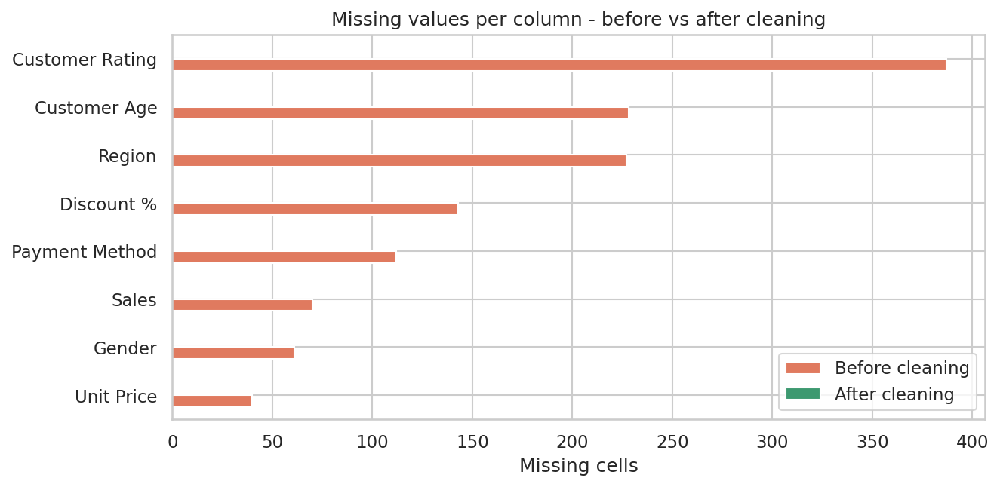
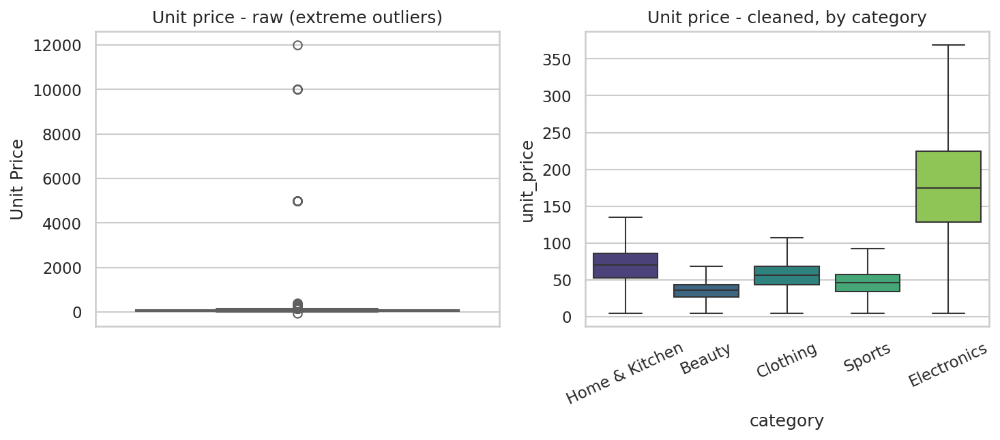
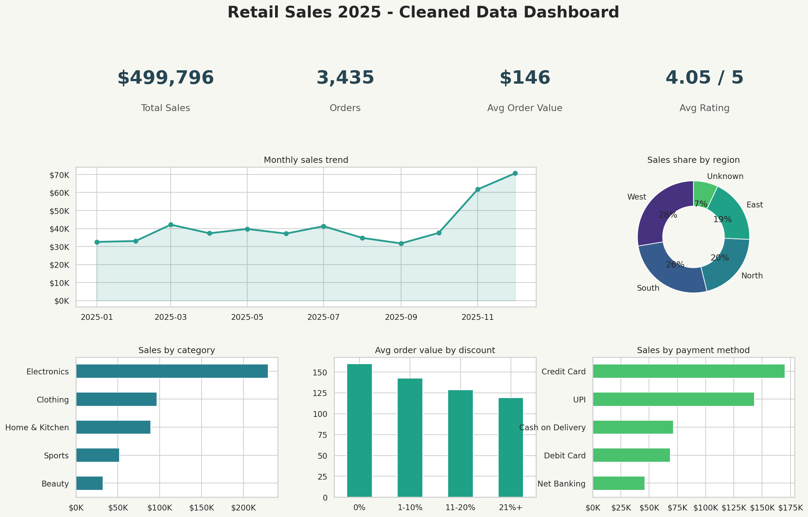

# Data Cleaning & Visualization Project - Retail Sales 2025

**Goal:** take a raw, messy sales dataset, clean it (missing values, outliers, duplicates, inconsistent formats), and turn it into a dashboard and a short data story.
**Tools:** Python, Pandas, NumPy, Matplotlib, Seaborn

> **Dataset note:** the dataset (`data/raw_sales_data.csv`) is a synthetic retail sales dataset generated with `generate_raw_data.py`. Real-world problems were deliberately injected (duplicates, mixed date formats, impossible values, etc.) to practise the full cleaning workflow. The same pipeline works on any similar CSV.

---

## 1. Project structure
```
data/raw_sales_data.csv        raw, messy data (3,560 rows x 14 cols)
data/cleaned_sales_data.csv    final clean data (3,435 rows x 16 cols)
generate_raw_data.py           creates the raw dataset
clean_and_visualize.py         full pipeline: clean -> analyse -> charts
outputs/                       dashboard, charts, cleaning log, key metrics
```
Run: `pip install pandas numpy matplotlib seaborn` then `python generate_raw_data.py` and `python clean_and_visualize.py`.

## 2. Data quality problems found

| Problem | Found | Fix and reason |
|---|---|---|
| Duplicate rows | 110 | Dropped exact duplicates (same order recorded twice would inflate sales) |
| Mixed date formats (`2025-03-14`, `14/03/2025`, `Mar 14, 2025`) | 3 formats | Parsed each explicitly; avoids day/month confusion |
| Unparseable dates ("not available") | 15 rows | Dropped, because a sale without a date cannot be used in time analysis |
| Sales stored as text (`"$1,019.45"`) | ~250 | Stripped `$` and `,` and converted to numbers |
| Inconsistent text (`north `, `SOUTH`, `M`/`F`, `COD`, `HOME AND KITCHEN`) | hundreds | Trimmed, standardised case and mapped aliases to one label |
| Placeholder text `"nan"` | many | Converted to real missing values |
| Impossible values (age 250, quantity -3, rating 10, discount 100%) | 61 | Marked invalid using business rules (age 18-80, qty 1-10, rating 1-5, discount 0-50%) |
| Missing values | ~1,200 cells | See strategy below |
| Price outliers (e.g. $12,000 headphones) | 21 | Capped using the IQR rule **within each category** (a $250 watch is normal, a $250 T-shirt is not) |
| Inconsistent `sales` totals | 242 | Recomputed as quantity x unit price x (1 - discount) |

**Missing-value strategy**
- **Numeric (age, rating, quantity):** median, because it is not distorted by outliers.
- **Unit price:** median price of the same product.
- **Discount:** 0, because no discount recorded most likely means none was given.
- **Region:** labelled "Unknown". A location cannot be guessed, and filling with the most common region would artificially inflate it.
- **Gender, payment method:** mode (most frequent value).

**Result:** 3,560 rows -> **3,435 rows**, **0 missing values, 0 duplicates**. Rows removed: 125 (110 duplicates + 15 bad dates), about 3.5%.




## 3. Dashboard


## 4. Key insights (the story)

1. **Total sales were about $500K from 3,435 orders**, an average order value of $146 and an average rating of 4.05/5.
2. **Electronics is the revenue engine.** It is only about 20% of orders but **46% of total sales**, with an average order of $325 against $66-$130 for other categories. Clothing has the most orders (27%) but much lower value per order.
3. **Strong holiday seasonality.** Sales were flat at $32K-$42K per month until October, then jumped to $62K in November and $71K in December, **2.2x the weakest month (September, $32K)**. November and December together account for **26.5%** of annual sales.
4. **West and South lead.** West generates 28% of sales and South 26%; East is lowest at 19%. About 7% of sales have an unknown region, a data-capture issue worth fixing.
5. **Discounts did not create bigger baskets.** The average quantity per order is about 2 at every discount level (0% to 21%+). Orders with higher discounts therefore bring in less revenue per order, so deeper discounts are not paying for themselves in volume.
6. **Core customers are 26-45 years old**, generating about 66% of sales. The 56+ group contributes under 4%, which is a possible growth segment.
7. **Credit card and UPI dominate payments** (together about 63% of sales).
8. **Customer satisfaction is uniform.** Ratings are about 4.0-4.1 in every category, so quality is consistent and revenue differences come from price and volume.

## 5. Recommendations
- Build inventory and marketing capacity for Nov-Dec, and run campaigns in the Aug-Sep trough.
- Protect and grow Electronics, but cross-sell Clothing and Home & Kitchen to raise the value of the many small orders.
- Review discount policy: use targeted discounts rather than blanket ones.
- Make region a required field at checkout to remove the "Unknown" gap.
- Test campaigns for the 46+ customer group.

## 6. Skills demonstrated
Data inspection, duplicate removal, type conversion, text standardisation, rule-based validation, missing-value imputation, IQR outlier treatment, feature engineering (month, age group), multi-chart dashboard design, and data storytelling.

*Limitations: results come from synthetic data, and imputation adds assumptions (documented above). A real project would validate these choices with the data owner.*
